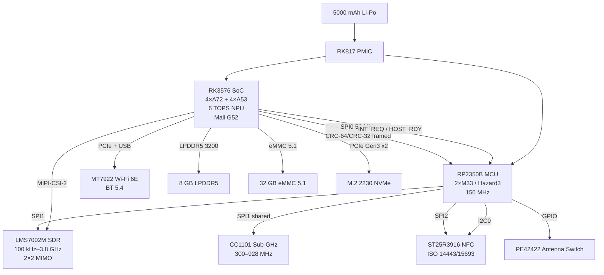
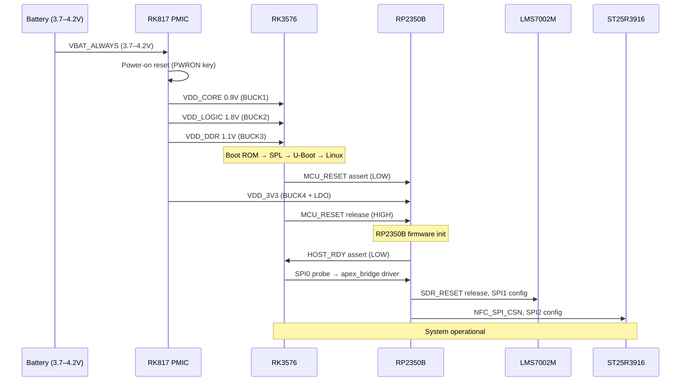
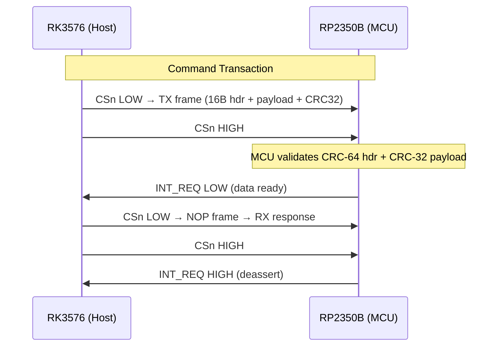

<div align="center">

# GhostBlade

### Project NullSpectre

**Advanced Mobile Pentesting Lab**

Dual-processor (RK3576 + RP2350B) SDR-equipped handheld with Wi-Fi 6E, sub-GHz, and NFC

[](LICENSE)
[](LICENSE)
[](LICENSE)
[](https://github.com/jayis1/ghostblade/commits/main)
[](https://github.com/jayis1/ghostblade/commits/main)
[](https://github.com/jayis1/ghostblade)
[](https://github.com/jayis1/ghostblade/issues)
[](https://github.com/jayis1/ghostblade/pulls)

</div>

---

## What Is This?

GhostBlade is a pocket-sized penetration testing device that combines a powerful Linux SoC with a real-time coprocessor to deliver wideband SDR, sub-GHz radio, NFC, and Wi-Fi 6E — all in a form factor that fits in your hand.

The RP2350B manages all RF frontends (antenna switching, SDR tuning, NFC polling) while the RK3576 runs a full Linux distribution with pentesting tools.

---

## Architecture at a Glance

```
┌─────────────────────────────────────────────────────────┐
│                  GhostBlade Board                        │
│                                                          │
│  ┌──────────────┐  SPI0 @ 50 MHz  ┌──────────────┐      │
│  │   RK3576     │◄──────────────►│   RP2350B     │      │
│  │  4xA72+4xA53 │  (framed CRC)  │ 2xM33/Hazard3 │      │
│  │  6 TOPS NPU  │                 │                │      │
│  │              │  INT_REQ ──────►│  RF Manager    │      │
│  │  Linux Host  │  HOST_RDY ◄────│  Real-time     │      │
│  └──────┬───────┘  MCU_RESET ────►└──┬──┬──┬──┬───┘      │
│         │                          │  │  │  │            │
│    MIPI-CSI-2               SPI1   │  │  │  PIO           │
│         │                    ┌──────┘  │  └───┐          │
│  ┌──────▼──────┐            │    ┌────┘      │          │
│  │  LMS7002M   │    ┌───────▼┐  ┌▼──────┐ ┌▼────────┐  │
│  │  SDR 100kHz │    │ CC1101 │  │ST25R  │ │ PE42422  │  │
│  │  – 3.8 GHz  │    │ Sub-GHz│  │ 3916  │ │ Antenna  │  │
│  │  2×2 MIMO   │    │        │  │ NFC   │ │ Switch   │  │
│  └──────┬──────┘    └───┬────┘  └───┬───┘ └────┬─────┘  │
│         │               │           │          │         │
│     [J3 SMA]       [J4 SMA]    [NFC coil]  [4× SMA]     │
│         │               │                      │         │
│  ┌──────▼───────────────▼──────────────────────▼──┐     │
│  │          MT7922 Wi-Fi 6E / BT 5.4               │     │
│  │    [J5 SMA 2.4G]  [J6 SMA 5/6G]  [BT]          │     │
│  └─────────────────────────────────────────────────┘     │
│                                                          │
│  ┌──────┐ 8GB LPDDR5  ┌────────┐ 32GB eMMC  ┌──────┐   │
│  │ DDR5 │◄────────────►│RK3576  │◄──────────►│ M.2  │   │
│  └──────┘              │        │            │NVMe  │   │
│                         └────────┘            └──────┘   │
└─────────────────────────────────────────────────────────┘
```

---

## System Block Diagram



## Power Sequencing Diagram



## SPI Bridge Protocol



---

## Repository Structure

```
ghostblade/
├── docs/
│   ├── index.md                              # Documentation index (start here)
│   ├── getting-started.md                      # Dev environment setup & build guide
│   ├── build-instructions.md                  # Detailed build instructions
│   ├── flashing-guide.md                      # Firmware flashing & driver loading
│   ├── faq-troubleshooting.md                 # Frequently asked questions
│   ├── pin-assignments.md                     # Pin cross-ref: schematic, DTS, firmware
│   ├── power-tree.md                          # Power tree diagram & rails
│   ├── spi-protocol-timing.md                # SPI bridge timing diagrams
│   ├── sysfs-attributes.md                   # Driver sysfs telemetry reference
│   ├── hardware-test-procedures.md             # 17-section test plan
│   ├── hardware-contributor-guide.md          # Hardware design guidelines
│   ├── contributing.md                        # How to contribute (code, docs, hardware)
│   ├── getting-started-contributors.md        # Contributor onboarding checklist
│   ├── phase1-conceptual/
│   │   └── architecture-and-requirements.md   # Power budgets, thermal, bus topology
│   ├── phase2-schematics/
│   │   └── component-selection-and-schematics.md  # BOM, netlists, decoupling
│   ├── phase3-pcb/
│   │   └── pcb-blueprints-and-layout.md       # Stackup, impedance, DFM
│   └── phase4-software/
│       └── boot-process-and-mmio.md           # Boot chain, register maps
├── firmware/
│   └── rp2350b/
│       ├── CMakeLists.txt                      # CMake build (Pico SDK)
│       ├── pico_sdk_import.cmake               # Pico SDK import
│       ├── rp2350b_memmap.ld                   # Linker script (memory map)
│       ├── include/
│       │   ├── board_pins.h                    # MCU pin definitions
│       │   ├── spi0_isr.h                      # SPI0 slave ISR API
│       │   └── ...                              # Other firmware headers
│       └── src/
│           ├── main.c                          # Entry point & init dispatch
│           ├── rp2350b_init.c                  # Clocks, GPIO, SPI, PIO, ADC init
│           ├── spi_protocol.c                  # SPI bridge protocol handler
│           ├── spi0_isr.c                      # SPI0 slave interrupt handler
│           ├── cc1101_init.c                   # CC1101 sub-GHz radio init
│           ├── st25r3916_init.c                # ST25R3916 NFC controller init
│           ├── sdr_dma.c                       # SDR DMA ring buffer manager
│           ├── battery_monitor.c               # ADC battery/temperature monitor
│           └── watchdog.c                      # Hardware watchdog handler
├── hardware/
│   ├── bom/
│   │   ├── ghostblade-bom.csv                  # Full BOM (80+ parts, MPN, price)
│   │   └── ghostblade-bom-interactive.html     # Interactive HTML BOM
│   ├── drc/
│   │   └── ghostblade-drc-rules.kicad_drc     # KiCad custom DRC rules (IPC Class 3)
│   └── kicad/
│       ├── ghostblade.kicad_pro                # KiCad 8 project file
│       ├── ghostblade.net                      # Schematic netlist (150+ nets)
│       ├── symbols/
│       │   └── ghostblade-symbols.kicad_sym
│       ├── footprints/
│       │   └── ghostblade-footprints.pretty/
│       │       └── ghostblade-footprints.kicad_mod
│       └── 3dmodels/
│           └── README.md                       # STEP model references
├── software/
│   ├── linux-drivers/
│   │   ├── include/
│   │   │   └── apex_bridge_regs.h              # Register defs, ioctl, protocol
│   │   ├── src/
│   │   │   └── apex_bridge.c                  # Kernel SPI driver (char dev)
│   │   ├── Kconfig                             # Kernel menuconfig entry
│   │   └── Makefile                            # Cross-compile Makefile
│   ├── libapex/
│   │   ├── include/
│   │   │   └── libapex.h                      # Userspace C API
│   │   ├── src/
│   │   │   ├── libapex.c                      # C library implementation
│   │   │   └── pyapex.c                        # Python bindings
│   │   ├── libapex.pc.in                       # pkg-config template
│   │   ├── Makefile
│   │   ├── setup.py
│   │   └── README.md
│   └── dts/
│       ├── ghostblade-rk3576.dts              # Device tree source
│       ├── ghostblade-options.dts              # Optional hardware overlay
│       ├── ghostblade-sdr-overlay.dts          # SDR MIPI-CSI-2 + DMA overlay
│       └── Makefile                            # DTS compile & validate targets
├── tests/
│   ├── Makefile                               # Test build & run targets
│   ├── test_spi_protocol.c                    # SPI protocol unit tests
│   ├── test_battery_monitor.c                 # Battery monitor unit tests
│   ├── test_cc1101_config.c                  # CC1101 register config tests
│   ├── test_watchdog.c                        # Watchdog timer unit tests
│   ├── test_power_states.c                   # Power state machine tests
│   ├── test_sdr_dma.c                        # SDR DMA ring buffer tests
│   ├── test_spi0_isr.c                        # SPI0 ISR frame assembly tests
│   ├── test_libapex.c                          # libapex userspace library tests
│   ├── test_apex_bridge.c                     # Kernel module test harness
│   └── hil_spi_bridge_test.sh                 # HIL SPI bridge test script
├── tools/
│   └── generate_gerbers.py                    # Gerber/fab-note generation script
├── .clang-format                               # Linux kernel-style formatting config
├── .codespell.ignore                           # Project-specific spellcheck ignore list
├── .editorconfig                               # Cross-editor formatting rules
├── .gitignore                                  # Git ignore patterns
├── .markdownlint.json                          # Markdown linting rules
├── CHANGELOG.md                                # Project changelog
├── GhostBlade.mf                               # System Manifest
├── Makefile                                    # Top-level build convenience targets
├── stats.json                                  # Dynamic badge data (auto-updated)
├── CONTRIBUTING.md
├── LICENSE
└── README.md
```

---

## Key Specifications

| Parameter | Value |
|-----------|-------|
| Primary SoC | Rockchip RK3576 (4× A72 + 4× A53, 6 TOPS NPU) |
| Coprocessor | RP2350B (2× Cortex-M33 / Hazard3 RISC-V @ 150 MHz) |
| RAM | 8 GB LPDDR5 @ 3200 MT/s |
| Storage | 32 GB eMMC 5.1 + M.2 2230 NVMe (PCIe Gen3 ×2) |
| SDR | LMS7002M (100 kHz – 3.8 GHz, 2×2 MIMO, 12-bit) |
| Sub-GHz | CC1101 (300–928 MHz, OOK/FSK/GFSK) |
| NFC | ST25R3916 (ISO 14443 A/B, 15693, FeliCa) |
| Wi-Fi/BT | MT7922 (Wi-Fi 6E 2×2, BT 5.4) |
| Battery | 5000 mAh Li-Po (19.25 Wh) |
| Form Factor | 162 × 76 × 18 mm, ~320 g |
| PCB | 6-layer FR-4 (Isola 370HR), 1.6 mm, IPC Class 3 |

---

## Repository Stats

| Metric | Value |
|--------|-------|
|  | Firmware + kernel driver |
|  | Register defs + pin maps |
|  | Device tree source |
|  | Markdown documentation |
|  | Unique parts in bill of materials |
|  | All project files |

---

## Documentation Index

> **[Full documentation index →](docs/index.md)**

| Document | Description |
|----------|-------------|
| [Docs Index](docs/index.md) | Central documentation hub with all links |
| [Getting Started](docs/getting-started.md) | Dev environment setup, toolchain, first build |
| [Build Instructions](docs/build-instructions.md) | Detailed build steps for firmware, driver, libapex |
| [Flashing Guide](docs/flashing-guide.md) | Firmware flashing, driver loading, recovery |
| [FAQ & Troubleshooting](docs/faq-troubleshooting.md) | Common issues and solutions |
| [Pin Assignments](docs/pin-assignments.md) | Cross-reference: schematic, DTS, and firmware pin mappings |
| [Power Tree](docs/power-tree.md) | Power domain diagram, rail assignments, sequencing |
| [SPI Protocol & Timing](docs/spi-protocol-timing.md) | Bridge protocol, frame format, timing diagrams |
| [Sysfs Attributes](docs/sysfs-attributes.md) | Driver telemetry attributes, usage examples |
| [Hardware Test Procedures](docs/hardware-test-procedures.md) | 17-section manufacturing test plan |
| [Hardware Contributor Guide](docs/hardware-contributor-guide.md) | Schematic/PCB design guidelines, DRC rules |
| [Contributing](docs/contributing.md) | Code, documentation, and hardware contribution workflow |
| [Contributor Onboarding](docs/getting-started-contributors.md) | Step-by-step checklist for new contributors |

## Engineering Phases

| Phase | Document | Description |
|-------|----------|-------------|
| 1 | [architecture-and-requirements.md](docs/phase1-conceptual/architecture-and-requirements.md) | Power budgets, thermal profiles, data flow, bus topology, security threat model |
| 2 | [component-selection-and-schematics.md](docs/phase2-schematics/component-selection-and-schematics.md) | BOM, netlists, decoupling networks, matching networks, power sequencing |
| 3 | [pcb-blueprints-and-layout.md](docs/phase3-pcb/pcb-blueprints-and-layout.md) | 6-layer stackup, impedance, fly-by routing, RF isolation, thermal vias, DFM |
| 4 | [boot-process-and-mmio.md](docs/phase4-software/boot-process-and-mmio.md) | Boot chain, register maps, SPI protocol specification |

---

## Hardware Design Files

| File | Description |
|------|-------------|
| [ghostblade.kicad_pro](hardware/kicad/ghostblade.kicad_pro) | KiCad 8 project file (6-layer stackup, net classes) |
| [ghostblade-symbols.kicad_sym](hardware/kicad/symbols/ghostblade-symbols.kicad_sym) | Symbol library (RK3576, RP2350B, LMS7002M, CC1101, ST25R3916, PE42422, MT7922, RK817, LPDDR5) |
| [ghostblade-footprints.kicad_mod](hardware/kicad/footprints/ghostblade-footprints.pretty/ghostblade-footprints.kicad_mod) | Footprint library (FCBGA-732, QFN-60, QFN-64, all packages) |
| [ghostblade.net](hardware/kicad/ghostblade.net) | Schematic netlist (150+ nets, all IC connections) |
| [ghostblade-drc-rules.kicad_drc](hardware/drc/ghostblade-drc-rules.kicad_drc) | Custom DRC rules (IPC Class 3, RF/high-speed constraints) |
| [ghostblade-bom.csv](hardware/bom/ghostblade-bom.csv) | Full bill of materials (80+ line items, MPN, price) |
| [ghostblade-bom-interactive.html](hardware/bom/ghostblade-bom-interactive.html) | Interactive HTML BOM (search, filter, sort, cost calc) |
| [3D models README](hardware/kicad/3dmodels/README.md) | STEP model references and parametric generation scripts |

---

## Inter-Processor Bridge Protocol

The RK3576 and RP2350B communicate over SPI0 at up to 50 MHz using a framed protocol:

```
┌────────┬─────┬──────┬──────────┬──────────┬─────────┬──────────┬────────┐
│ SYNC   │ CMD │ LEN  │ RESERVED │ HDR_CRC  │ PAYLOAD │ PAYLOAD  │ PADDING │
│ 0xAA   │ 1B  │ 2B   │ 4B       │ 8B (CRC64)│ 0-4092B │ CRC32    │         │
└────────┴─────┴──────┴──────────┴──────────┴─────────┴──────────┴────────┘
 Byte 0    1     2-3     4-7        8-15       16-n      n+1..n+4
```

See `apex_bridge_regs.h` for full opcode definitions.

---

## Getting Started

### Prerequisites

- Linux host with `arm-none-eabi-gcc` for RP2350B firmware
- `aarch64-linux-gnu-gcc` cross-compiler for RK3576 Linux
- KiCad 8+ for schematic/PCB editing
- Linux kernel 6.6+ headers for driver compilation

### Building the Linux Driver

```bash
cd software/linux-drivers
make -C /path/to/kernel/src M=$(pwd) modules
sudo insmod apex_bridge.ko
```

### Building RP2350B Firmware

```bash
cd firmware/rp2350b
mkdir build && cd build
cmake .. -DPICO_SDK_PATH=/path/to/pico-sdk
make -j$(nproc)
```

### Generating Gerber Files

```bash
python3 tools/generate_gerbers.py --fab-note --zip
```

---

## License

- **Hardware designs** (schematics, PCB layouts, BOM): [CERN-OHL-S v2](LICENSE)
- **Firmware and software**: [GPL-2.0-or-later](LICENSE)
- **Documentation**: [CC-BY-SA 4.0](LICENSE)

---

## Changelog

See [CHANGELOG.md](CHANGELOG.md) for a record of all notable changes.

---

## Contributing

See [CONTRIBUTING.md](CONTRIBUTING.md) for guidelines. In short:

1. Fork the repository
2. Create a feature branch (`git checkout -b feature/my-feature`)
3. Commit your changes with clear descriptions
4. Push to your fork and open a Pull Request

---

*GhostBlade — Project NullSpectre. Designed for those who build, test, and secure.*