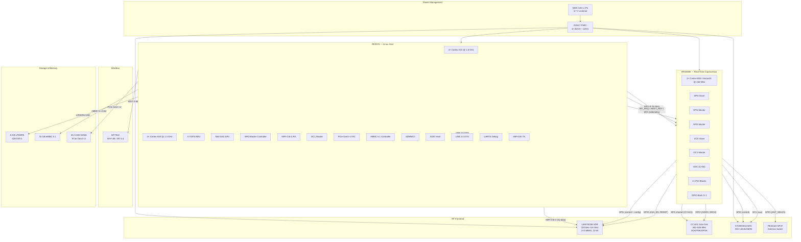
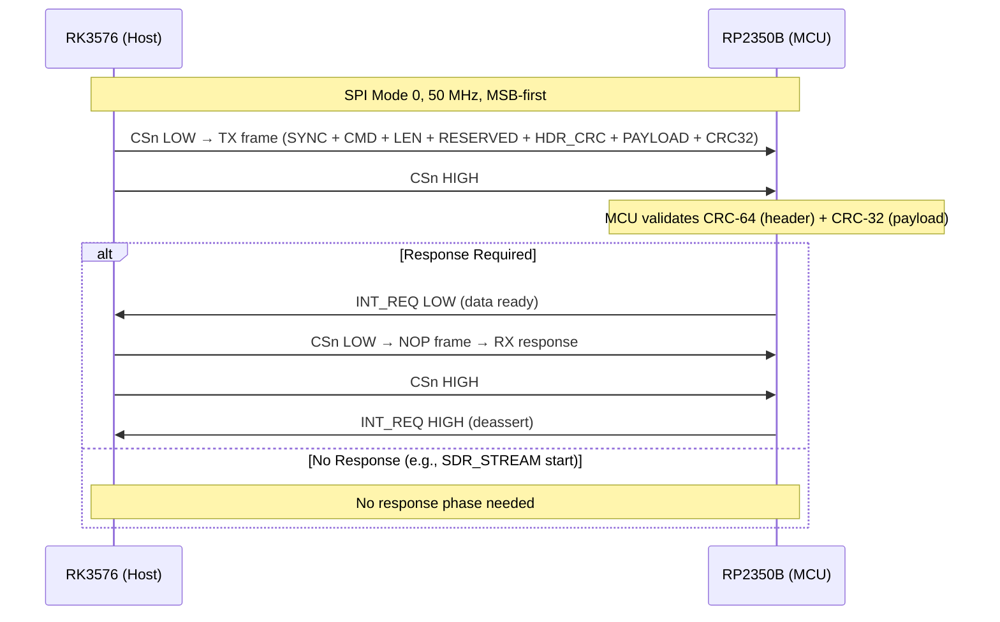
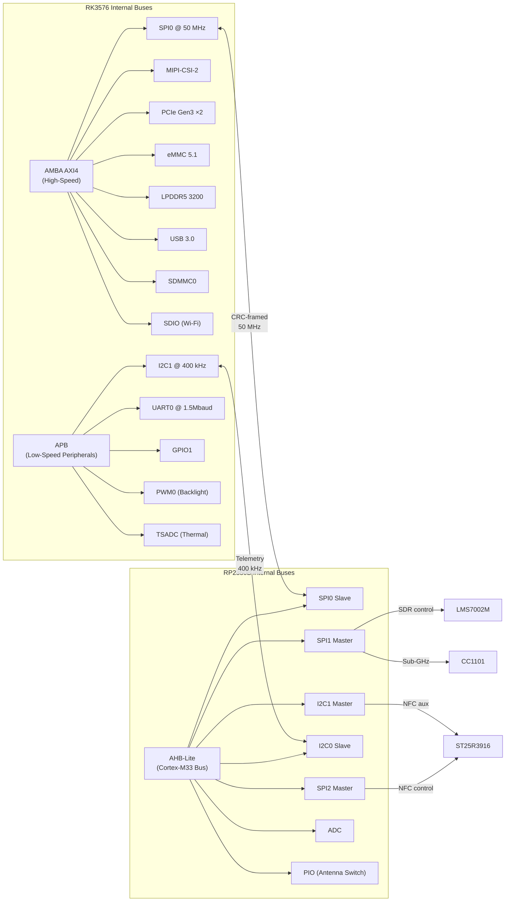
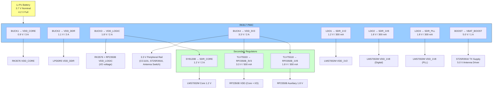
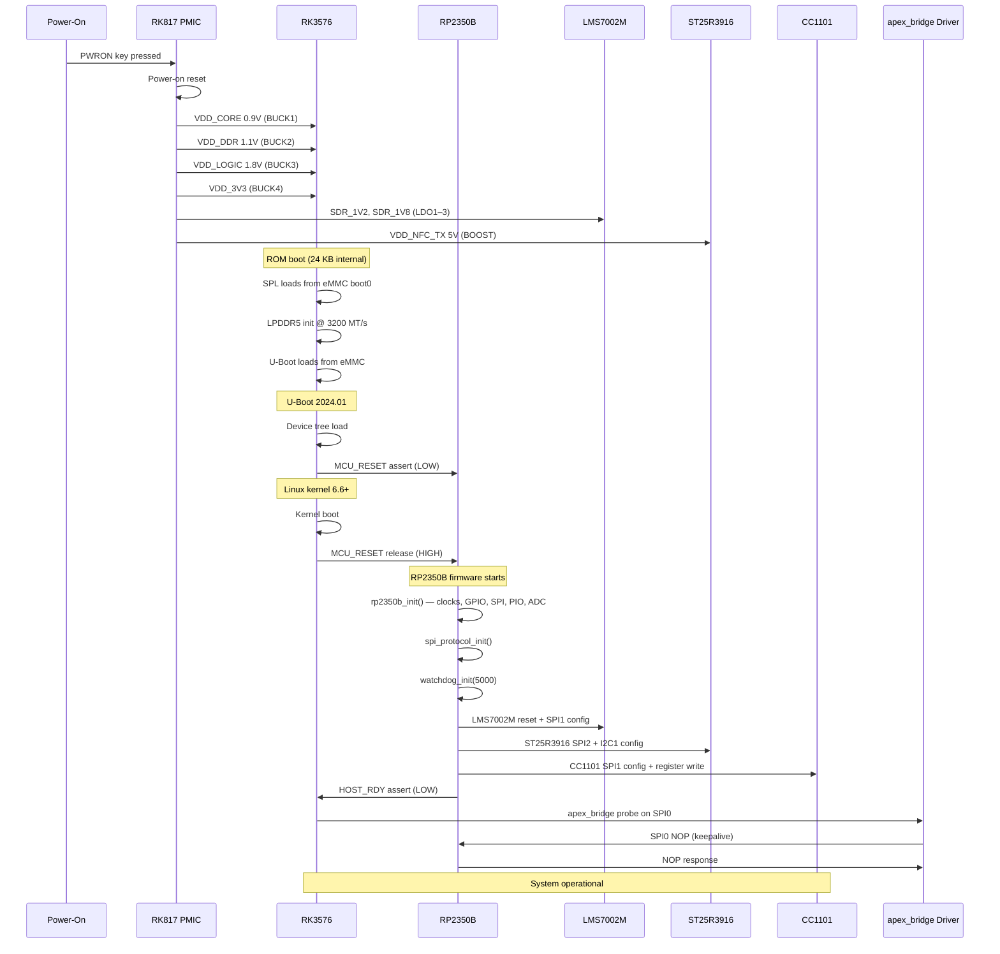
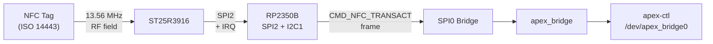
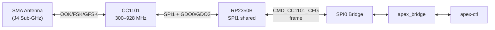
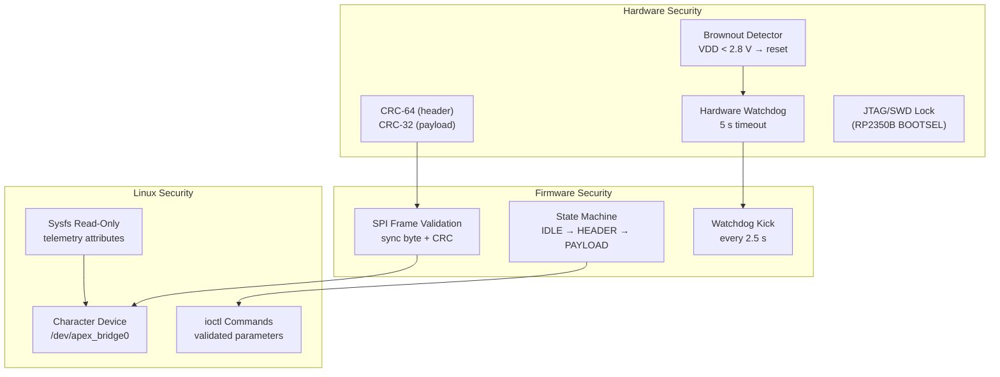

# GhostBlade — System Architecture Overview

**Project:** GhostBlade (Project NullSpectre)
**Revision:** 1.0
**Date:** 2026-06-23
**License:** CC-BY-SA 4.0

---

## Table of Contents

1. [Introduction](#introduction)
2. [System Architecture Diagram](#system-architecture-diagram)
3. [Processor Architecture](#processor-architecture)
4. [Inter-Processor Communication](#inter-processor-communication)
5. [Memory Map](#memory-map)
6. [Peripheral Bus Map](#peripheral-bus-map)
7. [Power Domain Architecture](#power-domain-architecture)
8. [Boot Sequence](#boot-sequence)
9. [Data Flow Paths](#data-flow-paths)
10. [Security Model](#security-model)

---

## Introduction

This document provides a high-level architectural overview of the GhostBlade dual-processor pentesting device. It connects the information spread across the schematic netlist (`GhostBlade.mf`), device tree (`software/dts/`), firmware headers (`firmware/rp2350b/include/`), and kernel driver (`software/linux-drivers/`) into a single reference.

For detailed pin assignments, see [Pin Assignments](pin-assignments.md).
For power rail specifications, see [Power Tree](power-tree.md).
For SPI protocol details, see [SPI Protocol & Timing](spi-protocol-timing.md).

---

## System Architecture Diagram

---

## Processor Architecture

### RK3576 — Linux Host Processor

| Feature | Specification |
|---------|--------------|
| CPU | 4× Cortex-A72 @ 1.8 GHz + 4× Cortex-A53 @ 1.4 GHz (big.LITTLE) |
| NPU | 6 TOPS (INT8) |
| GPU | Mali-G52 MP2 |
| RAM | 8 GB LPDDR5 @ 3200 MT/s (2× 4 GB Samsung K3LKBKB0BM-MGCJ) |
| Storage | 32 GB eMMC 5.1 (Kioxia THGBMJG6C1LBAB7) |
| Expansion | M.2 2230 NVMe (PCIe Gen3 ×2) |
| OS | Linux kernel 6.6+ (Buildroot / Yocto) |
| Driver | `apex_bridge` SPI character device driver |

### RP2350B — Real-Time Coprocessor

| Feature | Specification |
|---------|--------------|
| CPU | 2× Cortex-M33 + 2× Hazard3 RISC-V @ 150 MHz |
| SRAM | 520 KB (4 banks × 130 KB) |
| PSRAM | Optional off-chip PSRAM via QSPI |
| SPI0 | Slave interface to RK3576 (up to 50 MHz) |
| SPI1 | Master to LMS7002M SDR + CC1101 sub-GHz |
| SPI2 | Master to ST25R3916 NFC |
| I2C0 | Slave to RK3576 (telemetry/monitoring) |
| I2C1 | Master to ST25R3916 (auxiliary control) |
| ADC | 12-bit, 4 channels (battery, temperature, VBAT, VDD) |
| PIO | 2× programmable I/O blocks for antenna switching |
| Watchdog | Hardware watchdog timer (5 s timeout) |

---

## Inter-Processor Communication

The RK3576 and RP2350B communicate over two buses:

### Primary: SPI0 (Command/Data Path)

| Signal | Direction | RK3576 GPIO | RP2350B Pin | Function |
|--------|-----------|-------------|-------------|----------|
| SPI0_SCK | RK3576 → RP2350B | GPIO1_A2 | PIN_18 | SPI clock |
| SPI0_MOSI | RK3576 → RP2350B | GPIO1_A0 | PIN_19 | Host → MCU data |
| SPI0_MISO | RP2350B → RK3576 | GPIO1_A1 | PIN_16 | MCU → Host data |
| SPI0_CSn | RK3576 → RP2350B | GPIO1_A3 | PIN_17 | Chip select (active low) |
| INT_REQ | RP2350B → RK3576 | GPIO1_B0 | PIN_20 | MCU interrupt request |
| HOST_RDY | RK3576 → RP2350B | GPIO1_B1 | PIN_21 | Host ready signal |
| MCU_RESET | RK3576 → RP2350B | GPIO1_B2 | PIN_24 | MCU reset (active low) |

### Secondary: I2C1 (Telemetry/Debug)

| Signal | Direction | RK3576 GPIO | RP2350B Pin | Function |
|--------|-----------|-------------|-------------|----------|
| I2C1_SDA | Bidirectional | I2C1_SDA | PIN_25 | Data line |
| I2C1_SCL | RK3576 → RP2350B | I2C1_SCL | PIN_26 | Clock line |

I2C address: `0x42` (RP2350B slave address for telemetry polling).

---

## Memory Map

### RP2350B SRAM Layout

| Section | Address Range | Size | Purpose |
|---------|--------------|------|---------|
| `.text` | `0x20000000` – `0x2003FFFF` | 256 KB | Code + rodata |
| `.data` / `.bss` | `0x20040000` – `0x2004FFFF` | 64 KB | Initialized/uninitialized data |
| `.dma.sdr_rx` | `0x20050000` – `0x2005FFFF` | 64 KB | SDR DMA RX ring buffer |
| `.dma.sdr_tx` | `0x20060000` – `0x2006FFFF` | 64 KB | SDR DMA TX buffer |
| SPI0 TX/RX | `0x20070000` – `0x2007FFFF` | 64 KB | SPI0 shared TX/RX buffers |
| Heap | `0x20080000` – `0x2007FFFF` | ~108 KB | Dynamic allocation |

See `firmware/rp2350b/rp2350b_memmap.ld` for the exact linker script.

### RK3576 Address Space (Linux)

| Device | Physical Address | Size | Description |
|--------|-----------------|------|-------------|
| SPI0 | `0xFE610000` | 4 KB | SPI master controller |
| I2C1 | `0xFE640000` | 4 KB | I2C master controller |
| MIPI-CSI-2 | `0xFE580000` | 64 KB | MIPI-CSI-2 receiver |
| PCIe | `0xFE150000` | 64 KB | PCIe Gen3 controller |
| eMMC | `0xFE330000` | 64 KB | eMMC 5.1 controller |
| SDIO | `0xFE2C0000` | 4 KB | SDIO host controller |
| UART0 | `0xFEB50000` | 4 KB | Debug serial console |
| GPIO1 | `0xFDC20000` | 256 B | GPIO bank 1 |
| TSADC | `0xFE730000` | 4 KB | Thermal sensor ADC |

---

## Peripheral Bus Map

---

## Power Domain Architecture

Power sequencing (from [Power Tree](power-tree.md)):

1. VBAT_ALWAYS → PMIC power-on reset
2. BUCK1 → VDD_CORE (0.9 V, < 5 ms from PWR_ON)
3. BUCK2 → VDD_DDR (1.1 V, < 2 ms after BUCK1)
4. BUCK3 → VDD_LOGIC (1.8 V, < 2 ms after BUCK2)
5. BUCK4 → VDD_3V3 (3.3 V, < 2 ms after BUCK3)
6. LDO1–3 → SDR supplies (< 10 ms after BUCK4 reaches 90%)
7. Total power-up sequence: < 50 ms

---

## Boot Sequence

---

## Data Flow Paths

### SDR IQ Data Path

```mermaid
graph LR
    ANT["SMA Antenna<br/>(J3 or J4)"]
    LNA["LNA + Filter"]
    LMS["LMS7002M<br/>ADC 12-bit<br/>Up to 61.44 MSPS"]
    DMA_MCU["RP2350B<br/>DMA → Ring Buffer<br/>8 × 512 bytes"]
    SPI["SPI0 Bridge<br/>50 MHz"]
    KDRV["apex_bridge<br/>Kernel Driver"]
    KFIFO["kfifo<br/>4 KB Ring Buffer"]
    USER["Userspace<br/>/dev/apex_bridge0"]

    ANT --> LNA --> LMS
    LMS -->|"MIPI-CSI-2<br/>(IQ samples)"| DMA_MCU
    DMA_MCU -->|"CRC-framed<br/>SPI frames"| SPI
    SPI --> KDRV
    KDRV --> KFIFO
    KFIFO --> USER

    style ANT fill:#f96,stroke:#333
    style LMS fill:#9cf,stroke:#333
    style DMA_MCU fill:#9f9,stroke:#333
    style KDRV fill:#ff9,stroke:#333
```

### NFC Transaction Path

### Sub-GHz Radio Path

---

## Security Model

**Planned future security enhancements:**
- AES-128-CTR encryption on the SPI bridge (firmware roadmap)
- Secure boot for RP2350B (signature verification)
- RP2350B JTAG/SWD lock after production programming
- RK3576 secure boot chain (eFUSE key provisioning)

---

## Related Documents

- [SPI Protocol & Timing](spi-protocol-timing.md) — Frame format, timing diagrams, CRC specification
- [Power Tree](power-tree.md) — Detailed power rail specifications and sequencing
- [Pin Assignments](pin-assignments.md) — Cross-reference: schematic net → DTS GPIO → firmware pin
- [Sysfs Attributes](sysfs-attributes.md) — Driver telemetry attributes and usage
- [Flashing Guide](flashing-guide.md) — How to flash firmware and load drivers
- [Hardware Test Procedures](hardware-test-procedures.md) — Manufacturing test plan
- [Getting Started](getting-started.md) — Development environment setup