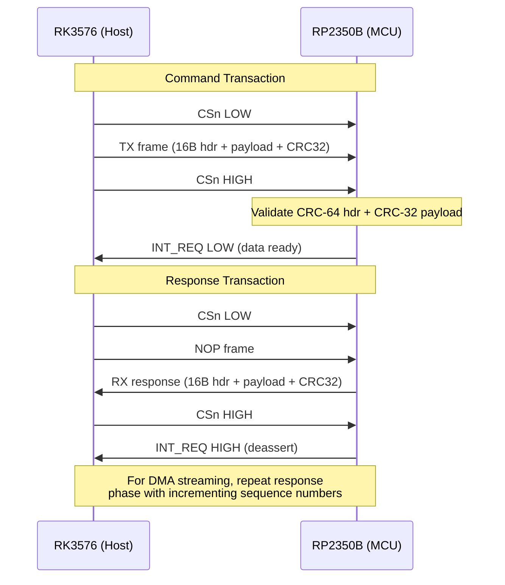

# SPI Bridge Protocol — Timing Diagrams

This document provides timing diagrams for the SPI0 communication bus
between the RK3576 host processor (SPI master) and the RP2350B coprocessor
(SPI slave). These diagrams cover the physical SPI timing, the framing
protocol, and the command-response sequences.

## SPI Bridge Transaction Flow



## 1. SPI Physical Layer Timing

### 1.1 SPI Mode Configuration

The SPI bridge operates in **SPI Mode 0** (CPOL=0, CPHA=0):

```
        ┌───┐   ┌───┐   ┌───┐   ┌───┐   ┌───┐   ┌───┐   ┌───┐   ┌───┐
SCK  ──┘   └───┘   └───┘   └───┘   └───┘   └───┘   └───┘   └───┘   └──
        ┆   ┆   ┆   ┆   ┆   ┆   ┆   ┆   ┆   ┆   ┆   ┆   ┆   ┆   ┆   ┆
MOSI ──┤D7 ├─┤D6 ├─┤D5 ├─┤D4 ├─┤D3 ├─┤D2 ├─┤D1 ├─┤D0 ├──────────────
        ┆   ┆   ┆   ┆   ┆   ┆   ┆   ┆   ┆   ┆   ┆   ┆   ┆   ┆   ┆   ┆
MISO ──┤D7 ├─┤D6 ├─┤D5 ├─┤D4 ├─┤D3 ├─┤D2 ├─┤D1 ├─┤D0 ├──────────────
```

| Parameter           | Symbol   | Min  | Typical | Max  | Unit |
|---------------------|----------|------|---------|------|------|
| SCK frequency       | f_SCK    | 0.5  | 21.4    | 25   | MHz  |
| Clock high time     | t_HI     | 18   | 23.4    | -    | ns   |
| Clock low time      | t_LO     | 18   | 23.4    | -    | ns   |
| CSn setup to SCK    | t_SU     | 10   | 50      | -    | ns   |
| CSn hold after SCK  | t_HD     | 10   | 50      | -    | ns   |
| MOSI setup to SCK   | t_SU_M   | 5    | 10      | -    | ns   |
| MISO valid after SCK| t_CO_M   | -    | 15      | 25   | ns   |
| CSn deselect time   | t_DIS    | 50   | 100     | -    | ns   |

### 1.2 Chip Select (CSn) Timing

CSn is active-low. The RP2350B's SPI0 slave is selected when CSn goes low.

```
         ┌───────────────────────────────────────────────────┐
CSn  ────┘                                                   └───
         │← t_SU →│← Transfer (N bytes) →│← t_HD →│← t_DIS →│
         │         │                       │        │         │
         │    ╱╲╱╲╱╲╱╲╱╲╱╲╱╲╱╲╱╲╱╲╱╲╱╲╱╲╱╲  │        │         │
SCK  ────┘    ╱╲╱╲╱╲╱╲╱╲╱╲╱╲╱╲╱╲╱╲╱╲╱╲╱╲╱╲╱╲╱╲ └───────┘         │
              ╱  ╲                                                  │
         ────╱    ╲─────────────────────────────────────────────────
```

## 2. Frame-Level Protocol Timing

### 2.1 Host-to-MCU Command Frame

The host sends a complete frame in one SPI transaction (CSn held low
throughout the entire frame).

```
     ┌──────────────────────────────────────────────────────────────────────────────┐
CSn  ┘                                                                              └
     │ Sync │ Cmd │ LenL │ LenH │ Rsv0 │ Rsv1 │ Rsv2 │ Rsv3 │ HdrCRC[0]...HdrCRC[7] │
     │ 0xAA │ 0x01│ 0x08 │ 0x00 │ 0x00 │ 0x00 │ 0x00 │ 0x00 │ 0xXX..0xXX (8 bytes)  │
     │      │     │ Header bytes 0-7                │ CRC-64/ECMA-182 (8 bytes)      │
     ├──────┴─────┴────────────────────────────────┴─────────────────────────────────┤
     │                        Payload (0-4092 bytes)                                  │
     ├────────────────────────────────────────────────────────────────────────────────┤
     │ PayCRC[0] │ PayCRC[1] │ PayCRC[2] │ PayCRC[3] │                              │
     └───────────┴───────────┴───────────┴───────────┴──────────────────────────────┘

     │←──── 16 bytes ───→│←──── payload_len ────→│←──── 4 bytes ────→│
     │                    │                        │                    │
     │  SPI Header         │  Payload Data          │  CRC-32 Trailer   │
```

### 2.2 MCU-to-Host Response Frame (Full-Duplex)

The SPI bus is full-duplex. While the host clocks out a command frame,
the MCU simultaneously clocks out its response in the MISO line.

```
     Host → MCU (MOSI):
     ┌────────────────────────────────────────────────────────────┐
     │ 0xAA │ CMD │ LEN │ ... │ HEADER + PAYLOAD + CRC            │
     └────────────────────────────────────────────────────────────┘

     MCU → Host (MISO):
     ┌────────────────────────────────────────────────────────────┐
     │ 0x00 │ 0x00 │ 0x00 │ ... │ NOP padding until response ready│
     └────────────────────────────────────────────────────────────┘
     ^                                                            ^
     MCU may not have response ready immediately;                  │
     sends 0x00 padding bytes until response is queued.           │
```

**Alternative: Interrupt-Driven Read**

If the MCU has pending data (e.g., telemetry or IQ chunks), it asserts
the INT_REQ GPIO line. The host then initiates a read-only transaction:

```
INT_REQ ─────────────────┐                         ┌─────────────
                        │                         │
                        └─────────────────────────┘
                        │← MCU has data ready →│

                        Host initiates SPI read:
     ┌────────────────────────────────────────────────────────────┐
CSn  ┘                                                            └
     │ 0xAA │ CMD │ LEN │ ... │ (Host sends read command)        │
     │ 0xAA │ 0x81│ 0x10│ ... │ (MCU sends telemetry response)   │
     └────────────────────────────────────────────────────────────┘
```

## 3. Command-Response Sequences

### 3.1 SDR Tune Command

```
  RK3576 (Host)                          RP2350B (MCU)
       │                                      │
       │──── SDR_TUNE (0x01) ────────────────→│
       │     freq=868MHz, bw=20MHz, gain=30dB  │
       │                                      │── Program LMS7002M via SPI1
       │                                      │── Wait PLL lock (~500μs)
       │←─── ACK (0x00 in next frame) ────────│
       │                                      │
       │  Timing:                              │
       │  │←── SPI transfer ──→│←── LMS7002M tune →│
       │  │    ~50μs           │    ~500μs          │
       │                                      │
```

### 3.2 SDR IQ Streaming (Continuous)

```
  RK3576 (Host)                          RP2350B (MCU)
       │                                      │
       │──── SDR_STREAM_START (0x02) ────────→│
       │                                      │── Enable DMA ring buffer
       │                                      │── Start LMS7002M RX
       │                                      │
       │←──── IQ_CHUNK (0x82) ────────────────│  ← DMA block 0 filled
       │      [512 bytes IQ data]             │
       │                                      │
       │←──── IQ_CHUNK (0x82) ────────────────│  ← DMA block 1 filled
       │      [512 bytes IQ data]             │
       │                                      │
       │      ... (continuous stream) ...     │
       │                                      │
       │──── SDR_STREAM_STOP (0x02) ─────────→│
       │                                      │── Stop DMA
       │                                      │── Disable LMS7002M RX
       │                                      │
       │  Timing per chunk:                   │
       │  │←── DMA fill ~2ms ──→│←── SPI TX ~0.3ms →│
       │  (at 256 ksps complex int16)          │
```

### 3.3 Telemetry Polling

```
  RK3576 (Host)                          RP2350B (MCU)
       │                                      │
       │──── TELEMETRY_REQ (0x06) ───────────→│
       │                                      │── Read ADC channels
       │                                      │── Read CC1101 RSSI
       │                                      │── Read ST25R3916 VDD
       │                                      │── Compose telemetry struct
       │←──── TELEMETRY (0x81) ──────────────│
       │      rssi=-740, temp=275, vbat=3850   │
       │      cc1101_rssi=-550, nfc=2500       │
       │      flags=0x0005, uptime=12345       │
       │                                      │
       │  Timing:                              │
       │  │←── SPI + ADC read ──→│             │
       │  │     ~2ms             │             │
```

### 3.4 CC1101 Configuration

```
  RK3576 (Host)                          RP2350B (MCU)
       │                                      │
       │──── CC1101_CFG (0x04) ──────────────→│
       │     addr=0x0D, len=3,                │
       │     data=[0x21, 0x63, 0x23]           │
       │     (FREQ2, FREQ1, FREQ0 for 868MHz) │
       │                                      │── Assert CC1101 CSn
       │                                      │── Write burst via SPI1
       │                                      │── Release CC1101 CSn
       │←─── ACK ─────────────────────────────│
       │                                      │
       │  Timing:                              │
       │  │←── SPI0 transfer ──→│←── SPI1 CC1101 write →│
       │  │     ~100μs          │     ~50μs              │
```

### 3.5 NFC Transaction (ISO 14443A REQA)

```
  RK3576 (Host)                          RP2350B (MCU)
       │                                      │
       │──── NFC_TRANSACT (0x05) ─────────────→│
       │     cmd=REQA, flags=0,               │
       │     data=[0x26]                       │
       │                                      │── Turn on 13.56 MHz field
       │                                      │── Send REQA via ST25R3916
       │                                      │── Wait for ATQA response
       │                                      │   (guard time ~5ms)
       │←──── NFC_TRANSACT response ──────────│
       │     [ATQA: 0x04 0x00]                │
       │                                      │
       │  Timing:                              │
       │  │←── SPI0 transfer →│←── NFC guard time →│←── ATQA RX →│
       │  │     ~100μs        │     ~5ms           │   ~1ms      │
```

### 3.6 MCU Software Reset (CMD_RESET_MCU)

```
  RK3576 (Host)                          RP2350B (MCU)
       │                                      │
       │──── RESET_MCU (0x07) ───────────────→│
       │     payload = 0x52534554             │
       │     (magic "RSET")                   │── Validate magic value
       │                                      │── Set scratch[0] = 0x48525354
       │                                      │    ("HRST" — host-triggered mark)
       │                                      │── watchdog_reboot(true)
       │                                      │    (does not return)
       │                                      │
       │  ═══ MCU RESET ═══                   │
       │                                      │
       │  SPI bus idle (~200 ms)              │
       │                                      │── Crystal oscillator start (~300μs)
       │                                      │── RP2350B boot ROM (~5 ms)
       │                                      │── Firmware initialization:
       │                                      │   ├── ADC calibration
       │                                      │   ├── SPI0 slave init
       │                                      │   ├── CC1101 init (~15 ms)
       │                                      │   ├── ST25R3916 init (~25 ms)
       │                                      │   ├── LMS7002M init (~50 ms)
       │                                      │   └── Watchdog kick
       │                                      │
       │←──── MCU_READY signal ────────────────│
       │                                      │
       │  Total reset time: ~200 ms typical
       │  (50 ms min, 500 ms max)
       │
       │  If wrong magic value is sent:
       │──── RESET_MCU (0x07) ───────────────→│
       │     payload = 0x00000000             │── Magic mismatch
       │                                      │── cmd_unknown_rx++
       │                                      │── Frame discarded
       │←──── Normal response continues ──────│
```

The software reset uses a two-stage magic value validation (0x52534554
"RSET") to prevent accidental resets from SPI bus noise or corrupted frames.
On successful validation, the MCU writes 0x48525354 ("HRST") to watchdog
scratch register 0 before triggering the reset, allowing the firmware to
distinguish a host-triggered reset from a watchdog timeout on the next boot.

## 4. Power Sequencing Timing

### 4.1 System Power-On Sequence

```
  Time →
  0ms    5ms     10ms    20ms    50ms    100ms   200ms   500ms
  │      │       │       │       │       │       │       │
  ├──PMIC PWR ON────────────────────────────────────────────┤
  │                                                      │
  ├──VDD_3V3 ramp ──────────┤                            │
  │                          │                            │
  ├──VDD_1V8 ramp ───────────────┤                        │
  │                             │                        │
  ├──VDD_5V_NFC ramp ─────────────────────┤             │
  │                                        │             │
  ├──RK3576 boot (U-Boot) ────────────────────────────────┤
  │                                                      │
  ├──RP2350B RSTn release ──────────────────┤            │
  │                                         │            │
  ├──RP2350B init ───────────────────────────────────┤   │
  │  ├──Clock config     │                              │   │
  │  ├──GPIO init        │                              │   │
  │  ├──SPI0 slave init  │                              │   │
  │  ├──SPI1 master init │                              │   │
  │  ├──CC1101 init ──────────────────────────┤         │   │
  │  ├──ST25R3916 init ───────────────────────────┤     │   │
  │  ├──LMS7002M init ────────────────────────────────┤  │   │
  │  ├──ADC/Watchdog   │                              │  │   │
  │  └──READY signal ───────────────────────────────→│  │   │
  │                                                   │  │   │
  ├──Linux kernel loads apex_bridge driver ────────────┤  │   │
  │                                                   │  │   │
  ├──Driver detects MCU_READY ───────────────────────→│  │   │
  │                                                   │  │   │
  └──System operational ──────────────────────────────────┘  │
```

### 4.2 MCU Reset Sequence

```
  Time →
  0μs    10μs    100μs   1ms     10ms    50ms
  │      │       │       │       │       │
  ├──MCU_RESET assert ─────────────────────────┤
  │  (GPIO low)                               │
  │                                            │
  ├──RP2350B resets in ~100μs ────────────┤   │
  │                                        │   │
  ├──All peripherals reset ────────────────┤   │
  │                                        │   │
  ├──MCU_RESET deassert ───────────────────────┤
  │  (GPIO high)                               │
  │                                            │
  ├──RP2350B boot ─────────────────────────────────┤
  │  (crystal start ~300μs)                       │
  │                                            │   │
  ├──RP2350B init ──────────────────────────────┤   │
  │                                            │   │
  ├──MCU_READY signal ─────────────────────────────→│
  │                                            │   │
```

## 5. Interrupt Timing

### 5.1 INT_REQ (MCU → Host) Assertion

```
  MCU has data:                INT_REQ asserted
       │                            │
       │◄──── t_INT_SETUP ─────────┤
       │                            │
       │  (MCU writes data to       │
       │   TX FIFO, then           │
       │   asserts INT_REQ)        │
       │                            ▼
  INT_REQ ─────────────────────────┐
                                    │
                                    │← Host detects via GPIO IRQ
                                    │
                                    │← Host initiates SPI read
                                    │
                                    ├─── SPI transaction ────┐
                                    │                         │
  INT_REQ ──────────────────────────┘  ← Deasserted after    │
                                         host reads all data  │
                                                               │
```

| Parameter            | Symbol       | Min | Typical | Max | Unit |
|----------------------|--------------|-----|---------|-----|------|
| INT_REQ setup time   | t_INT_SETUP  | 0   | 10      | -   | μs   |
| Host response time   | t_HOST_RESP  | 0.1 | 1       | 10  | ms   |
| INT_REQ pulse width  | t_INT_PW     | 1   | -       | -   | μs   |

## 6. DMA Ring Buffer Timing

### 6.1 SDR IQ Data Flow

```
  LMS7002M           RP2350B DMA          Ring Buffer           SPI0 → RK3576
  (RX data)          (Ch0: SPI1→Buf)     (8 × 512B blocks)     (Host read)

     │                    │                    │                    │
     │─── IQ samples ────→│                    │                    │
     │   (MIPI CSI-2     │── Write block 0 ──→│                    │
     │    or SPI1)       │                    │                    │
     │                    │── Write block 1 ──→│                    │
     │                    │                    │── Read block 0 ──→│
     │                    │── Write block 2 ──→│                    │
     │                    │                    │── Read block 1 ──→│
     │                    │      ...           │      ...           │
     │                    │                    │                    │

  Block fill time @ 256 ksps:  ~2 ms (512 bytes / 256000 bytes/s × 8 bits)
  Block SPI0 TX time @ 21 MHz: ~0.3 ms (512 bytes × 8 bits / 21.4 MHz)
  Minimum latency: ~2.3 ms per block
```

## 7. CC1101 Sub-GHz Transaction Timing

### 7.1 CC1101 State Machine Transitions

The CC1101 radio state machine transitions are triggered by command strobes
sent from the RP2350B via SPI1. Each transition has a defined settling time.

```
                        ┌──────────────┐
                 SIDLE  │              │
            ┌───────────│     IDLE     │◄─────────────────────────┐
            │           │  (0x01)      │                           │
            │           └──────┬───────┘                           │
            │                  │                                   │
            │        ┌───────┤                                   │
            │        │       │                                   │
            │    SRX strobe   SCAL strobe                     SRES
            │        │       │                                   │
            │        ▼       ▼                                   │
            │  ┌──────────┐ ┌──────────┐                        │
            │  │    RX    │ │   MANCAL  │                        │
            │  │  (0x0A)  │ │  (0x05)   │                        │
            │  └────┬─────┘ └────┬──────┘                        │
            │       │            │                               │
            │   RX data     Calibration done                     │
            │  complete         │                               │
            │       │            │                               │
            │       ▼            ▼                               │
            │  ┌──────────┐  ┌──────────┐    STX strobe         │
            │  │  RX_END  │  │ SETTLING  │◄─────────┐            │
            │  │  (0x0B)  │  │  (0x08)   │          │            │
            │  └────┬─────┘  └────┬──────┘          │            │
            │       │            │                  │            │
            │   RX_RST      TX/RX settling         │            │
            │       │            │                  │            │
            │       ▼            ▼                  │            │
            │  ┌──────────┐  ┌──────────┐           │            │
            │  │  RX_RST  │  │    TX    │───────────┘            │
            │  │  (0x0C)  │  │  (0x0D)  │                        │
            │  └────┬─────┘  └────┬──────┘                        │
            │       │            │                               │
            │       │       TX complete                         │
            │       │            │                               │
            │       │            ▼                               │
            │       │     ┌──────────┐                           │
            │       │     │  TX_END  │──────────────────────────┘
            │       │     │  (0x0E)  │   (returns to IDLE via SIDLE)
            │       │     └──────────┘
            │       │
            │       └──► (returns to IDLE via SIDLE)
            │
            └──► SLEEP (0x00) via SPWD strobe
                 (wake via CSn pulse or WOR timer)
```

### 7.2 CC1101 Command Strobe Timing

| Strobe  | From State | To State   | Settling Time | Notes                        |
|---------|-----------|------------|---------------|------------------------------|
| SRES    | Any       | IDLE       | ~1.5 ms       | Full chip reset              |
| SFSTXON | IDLE      | FSTXON     | ~100 μs       | Enable synth, no TX          |
| SXOFF   | IDLE      | XOFF       | ~2 μs         | Crystal off                  |
| SCAL    | IDLE      | MANCAL     | ~150 μs       | Run calibration              |
| SRX     | IDLE      | RX         | ~310 μs       | Enter RX mode               |
| STX     | IDLE      | TX         | ~310 μs       | Enter TX mode               |
| SIDLE   | Any       | IDLE       | ~2 μs         | Force idle                   |
| SAFC    | —         | —          | ~150 μs       | AFC adjustment              |
| SWOR    | IDLE      | WOR        | ~2 μs         | Start WOR                    |
| SPWD    | IDLE      | SLEEP      | ~2 μs         | Power-down                   |
| SFRX    | —         | —          | ~2 μs         | Flush RX FIFO               |
| SFTX    | —         | —          | ~2 μs         | Flush TX FIFO               |

### 7.3 CC1101 SPI1 Transaction Timing

```
  RP2350B (SPI1 Master)                     CC1101 (SPI1 Slave)
       │                                         │
       │── CSn low ─────────────────────────────→│
       │── Write header byte ──────────────────→│
       │  (0x00 for config reg write single)     │
       │                                         │
       │── Write address byte ──────────────────→│
       │  (e.g., 0x10 for MDMCFG4)              │
       │                                         │
       │── Write data byte ─────────────────────→│
       │  (e.g., 0x8F for MDMCFG4 value)        │
       │                                         │
       │── CSn high ────────────────────────────→│
       │                                         │
       │  Total: ~5 μs per register write        │
       │  (at 10 MHz SPI1 clock)                 │
       │                                         │
       │── Full config write (47 registers):     │
       │  ~235 μs (single), ~90 μs (burst)       │
```

### 7.4 CC1101 Register Configuration Burst Write

Burst mode writes all 47 configuration registers in a single CSn assertion:

```
  CSn  ──┐                                                                 ┌──
         │                                                                 │
  SCK  ──┤ ╱╲╱╲╱╲╱╲╱╲╱╲╱╲╱╲╱╲╱╲╱╲╱╲╱╲╱╲╱╲╱╲╱╲╱╲╱╲╱╲╱╲╱╲╱╲╱╲╱╲╱╲╱╲╱╲ └────
         ││ 0x40 │0x00│0x0F│0x12│...47 regs...│0x12│0x1D│0x34│0x56│0x8B│0xC7│
  MOSI ──┤│header│IOCFG2│...│MDMCFG4│...│FREND0│...│PATABLE0-7│             │
         │                                                                 │
  Total: 48 bytes × 8 bits / 10 MHz ≈ 38.4 μs for full burst config
```

## 8. ST25R3916 NFC Transaction Timing

### 8.1 NFC ISO 14443A Transaction Sequence

```
  RP2350B (SPI2 Master)                     ST25R3916 (NFC Controller)
       │                                         │
       │── st25r3916_start_polling() ──────────→│
       │  │  Clear IRQs                          │
       │  │  Enable OP_CTRL (TX_EN|RX_EN)        │
       │  │  TX_ON command                        │
       │  │                                      │
       │  │          ┌── 13.56 MHz field on ─────┤
       │  │          │                            │
       │  │  ~5 ms field stabilization            │
       │  │          │                            │
       │  │── st25r3916_transact(REQA) ────────→│
       │  │  │  Clear IRQs                       │
       │  │  │  Write NUM_TX_BYTES = 1            │
       │  │  │  Write TX_FIFO = 0x26 (REQA)      │
       │  │  │  TX_ON command                     │
       │  │  │                                    │
       │  │  │       ┌── TX REQA (7-bit short) ──┤──→ Antenna field
       │  │  │       │                            │
       │  │  │  ~5 ms guard time (ISO 14443A)     │
       │  │  │       │                            │
       │  │  │       │←── ATQA response ──────────┤←── Tag responds
       │  │  │       │    (2 bytes: e.g., 0x04 0x00)│
       │  │  │       │                            │
       │  │  │  RX complete → IRQ1_RXE            │
       │  │  │  Read NUM_RX_BYTES                │
       │  │  │  Read RX FIFO → ATQA data         │
       │  │  │  TX_OFF command                    │
       │  │  │                                    │
       │  │←── Return ATQA (0x04 0x00) ──────────│
       │  │                                      │
       │  │── st25r3916_stop_polling() ─────────→│
       │  │  │  TX_OFF                            │
       │  │  │  Disable OP_CTRL                   │
       │  │  │  Clear IRQs                        │
       │  │                                      │
       │←──── ATQA response ─────────────────────│
       │                                         │
       │  Total REQA transaction: ~7-10 ms       │
       │    - Field stabilization: ~5 ms         │
       │    - TX REQA: ~100 μs                   │
       │    - Guard time: ~5 ms                  │
       │    - RX ATQA: ~1 ms                     │
```

### 8.2 ST25R3916 SPI2 Register Access Timing

```
  RP2350B (SPI2 Master)                     ST25R3916 (SPI2 Slave)
       │                                         │
       │── CSn low ─────────────────────────────→│
       │                                         │
       │── Write address byte ──────────────────→│
       │  Bit 7: Write (1) / Read (0)            │
       │  Bit 6: Space A (1) / Space B (0)      │
       │  Bits 5:0: Register address              │
       │                                         │
       │── Read/Write data byte(s) ────────────→│
       │  (1 byte for single, N bytes for burst) │
       │                                         │
       │── CSn high ────────────────────────────→│
       │                                         │
       │  Single register access: ~5 μs          │
       │  Burst register access: ~5 + 2N μs     │
       │  (at 10 MHz SPI2 clock)                │
```

### 8.3 ST25R3916 Initialization Timing

```
  Time →
  0μs     100μs    1ms      5ms      10ms     20ms
  │       │        │        │        │        │
  ├── Read IC_IDENTITY ──────────────────────────────────┤
  │  (expect 0x39 or 0x89)                               │
  │                                                       │
  ├── SET_DEFAULT command ───────────────────────────────┤
  │  (~100 μs for reset)                                 │
  │                                                       │
  ├── Write OSC_CONF (0x18) ─────────────────────────────┤
  │  (Enable 27.12 MHz oscillator)                       │
  │                                                       │
  ├── Oscillator stabilization ──────────────────────────┤
  │  (~1 ms typical)                                     │
  │                                                       │
  ├── Write IO_CONF1, IO_CONF2 ──────────────────────────┤
  ├── Write OP_CTRL (initially 0x00) ────────────────────┤
  ├── Write MODE_DEF (ISO 14443A) ──────────────────────┤
  ├── Write BIT_RATE, ISO14443A_MODE ─────────────────────┤
  ├── Write RX_CONF1-4, AGC_CONFIG ──────────────────────┤
  ├── Write AM_CONFIG, AM_GRANGE1-3 ─────────────────────┤
  ├── Write TX_DRIVER, TX_CURRENT ───────────────────────┤
  ├── Write CORR_CONF1-2 ─────────────────────────────────┤
  ├── Write TIMER_EMV, TIMER1-3 ──────────────────────────┤
  ├── Write WUP_TIMER, SLP_TIMER ────────────────────────┤
  ├── Write VREG_CONF ───────────────────────────────────┤
  ├── Write IRQ_MASK1-5 ──────────────────────────────────┤
  │                                                       │
  ├── CLEAR_IRQS command ─────────────────────────────────┤
  │                                                       │
  ├── Write ANT_CAL_TARGET, ANT_CAL_TIME ─────────────────┤
  ├── CALIBRATE_ANTENNA command ──────────────────────────┤
  │  (5-10 ms calibration)                               │
  │                                                       │
  ├── Write OP_CTRL (TX_EN|RX_EN = 0x03) ────────────────┤
  │                                                       │
  ├── Verify OSC_IRQ ─────────────────────────────────────┤
  │  (retry once if not set)                             │
  │                                                       │
  ├── INITIALIZE_DPO command ─────────────────────────────┤
  │                                                       │
  └── Initialization complete ────────────────────────────┘
     Total: ~15-20 ms
```