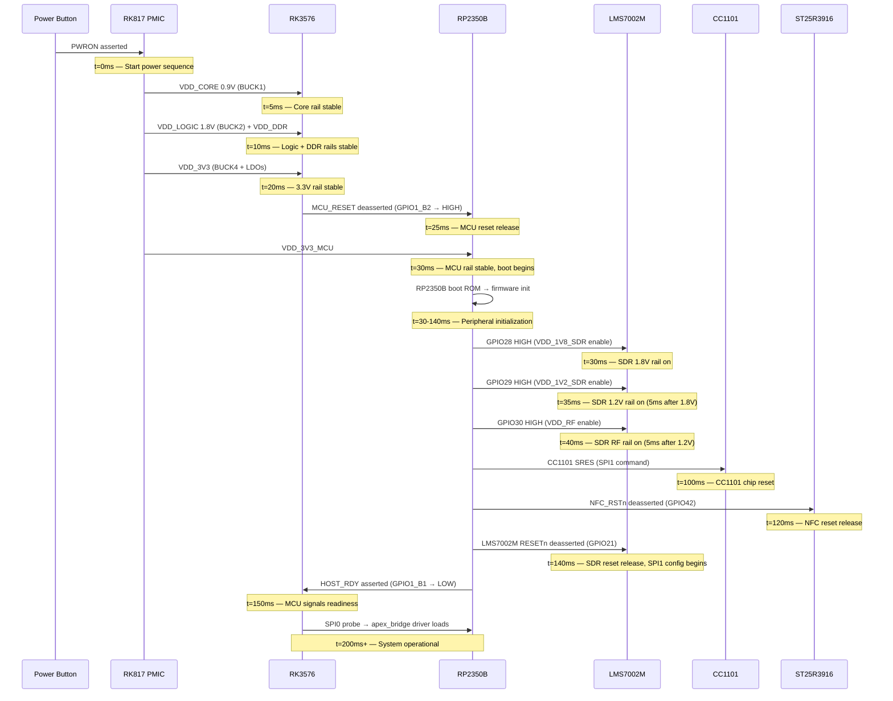
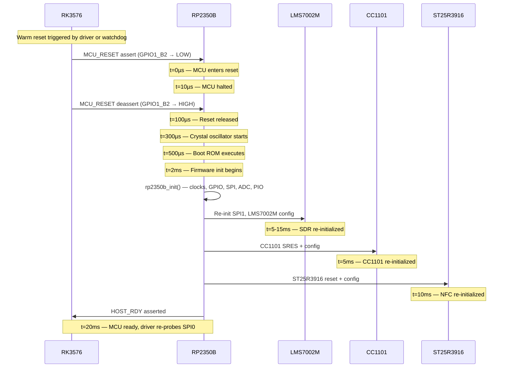
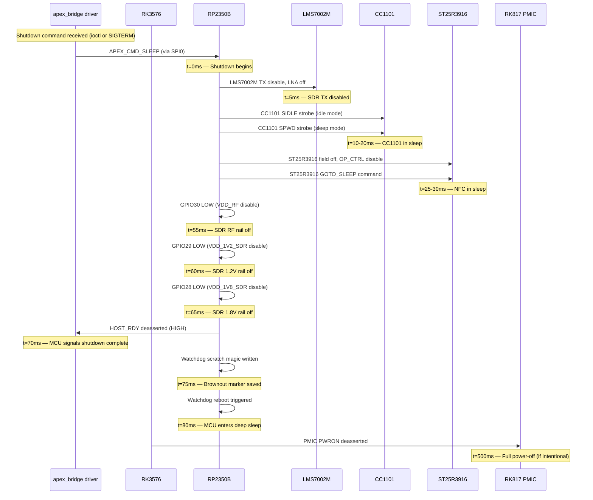
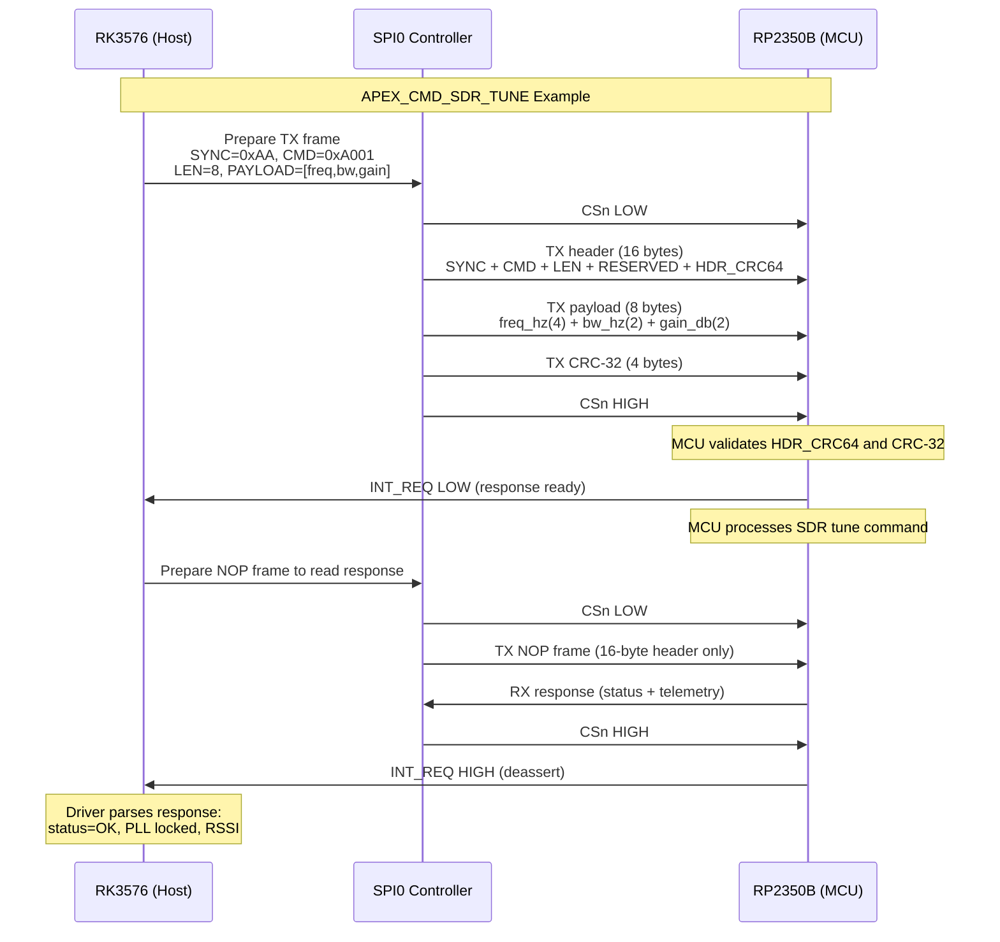
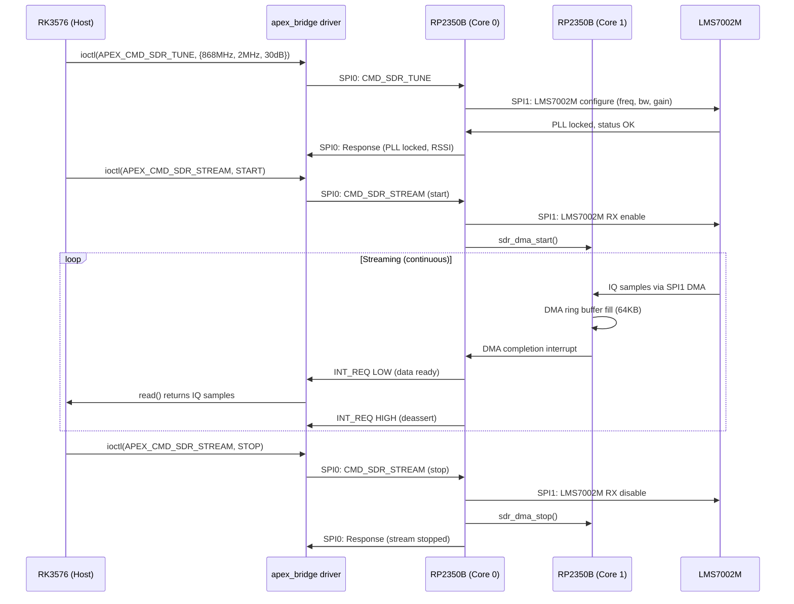
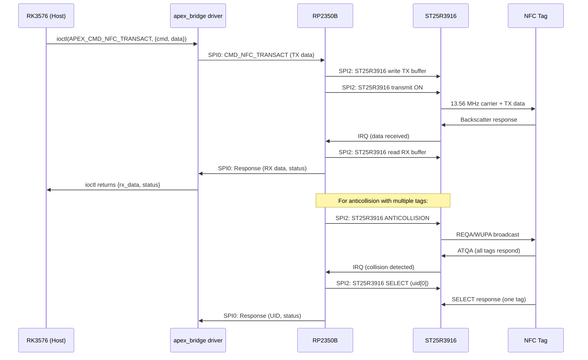
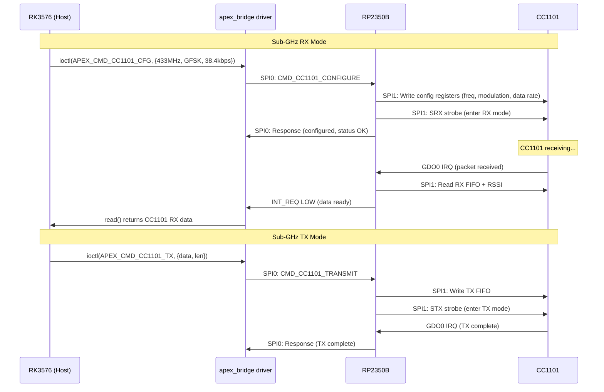
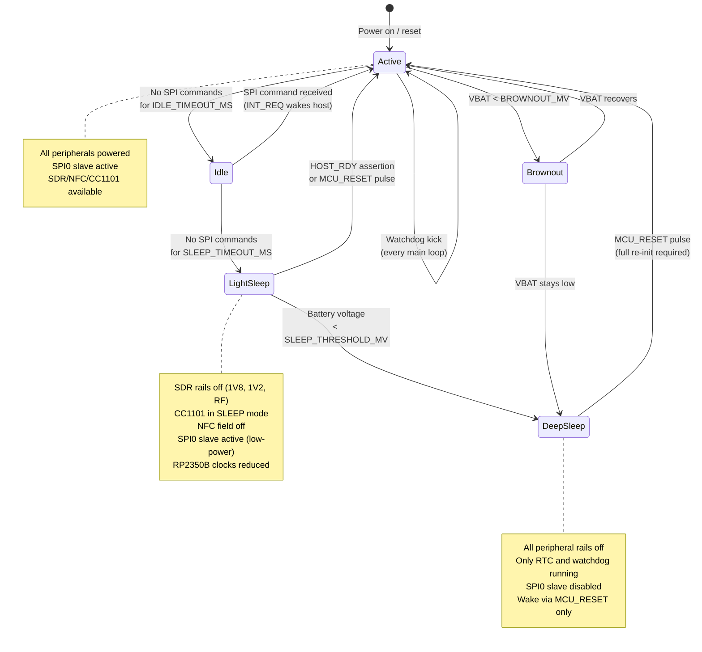
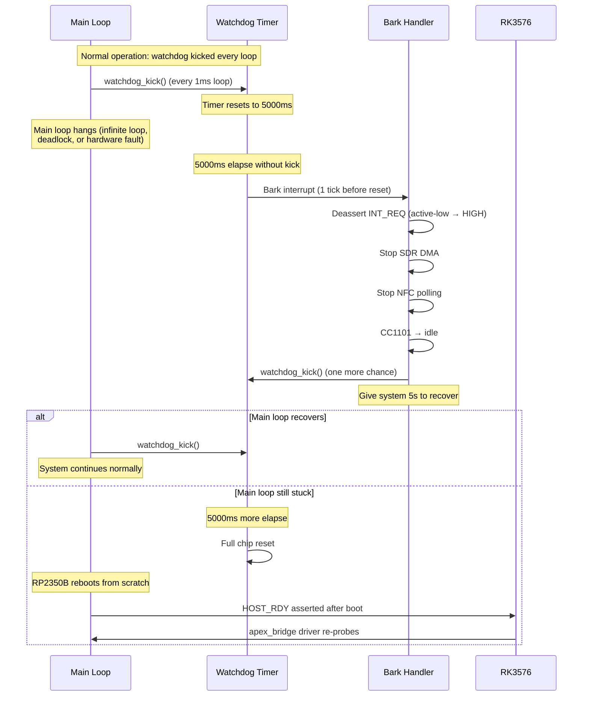
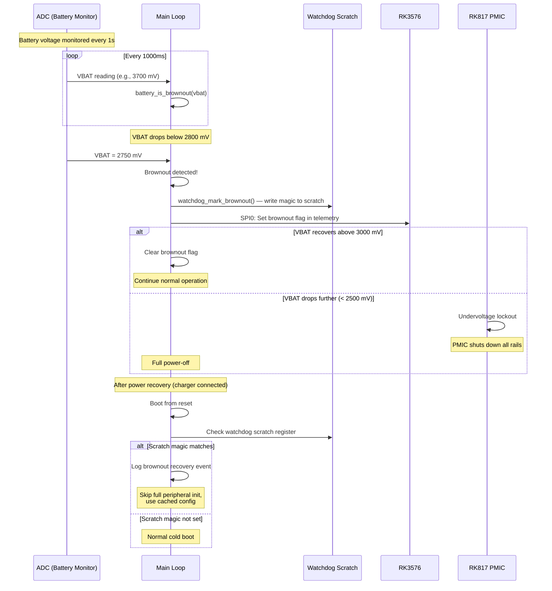

# GhostBlade — Timing Diagrams & Sequence Charts

<!-- SPDX-License-Identifier: CC-BY-SA-4.0 -->
<!-- Copyright (C) 2026 GhostBlade Project -->

This document provides Mermaid timing diagrams and sequence charts for key GhostBlade
operations. These diagrams complement the ASCII timing diagrams in
[power-sequencing-timing.md](power-sequencing-timing.md) and the protocol specifications
in [spi-protocol-timing.md](spi-protocol-timing.md).

---

## Table of Contents

1. [Cold Boot Power Sequencing](#1-cold-boot-power-sequencing)
2. [Warm Reset (MCU Only)](#2-warm-reset-mcu-only)
3. [Power-Down Sequence](#3-power-down-sequence)
4. [SPI Bridge Command Transaction](#4-spi-bridge-command-transaction)
5. [SDR DMA Streaming Flow](#5-sdr-dma-streaming-flow)
6. [NFC Transaction Flow](#6-nfc-transaction-flow)
7. [CC1101 Sub-GHz TX/RX Flow](#7-cc1101-sub-ghz-txrx-flow)
8. [Sleep/Wake State Machine](#8-sleepwake-state-machine)
9. [Watchdog Timeout Recovery](#9-watchdog-timeout-recovery)
10. [Brownout Detection & Recovery](#10-brownout-detection--recovery)

---

## 1. Cold Boot Power Sequencing

### Timing Constraints

| Parameter | Min | Typical | Max | Unit |
|-----------|-----|---------|-----|------|
| PMIC PWRON to VDD_CORE stable | 3 | 5 | 10 | ms |
| VDD_CORE to VDD_LOGIC stable | 3 | 5 | 10 | ms |
| VDD_LOGIC to VDD_3V3 stable | 5 | 10 | 15 | ms |
| VDD_3V3 to MCU_RESET release | 0 | 5 | 10 | ms |
| SDR 1.8V to SDR 1.2V delay | 5 | 5 | — | ms |
| SDR 1.2V to SDR RF delay | 5 | 5 | — | ms |
| CC1101 reset (SRES) duration | 300 | 300 | — | µs |
| NFC RSTn minimum pulse | 10 | 10 | — | µs |
| LMS7002M RESETn to SPI ready | 10 | 10 | — | ms |
| MCU_RESET release to HOST_RDY | 50 | 120 | 200 | ms |

---

## 2. Warm Reset (MCU Only)

---

## 3. Power-Down Sequence

---

## 4. SPI Bridge Command Transaction

---

## 5. SDR DMA Streaming Flow

---

## 6. NFC Transaction Flow

---

## 7. CC1101 Sub-GHz TX/RX Flow

---

## 8. Sleep/Wake State Machine

---

## 9. Watchdog Timeout Recovery

---

## 10. Brownout Detection & Recovery

---

*Document version: 1.0 — 2026-07-05*